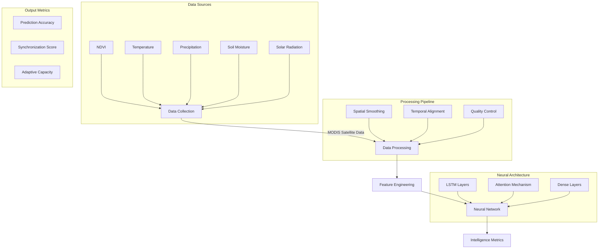
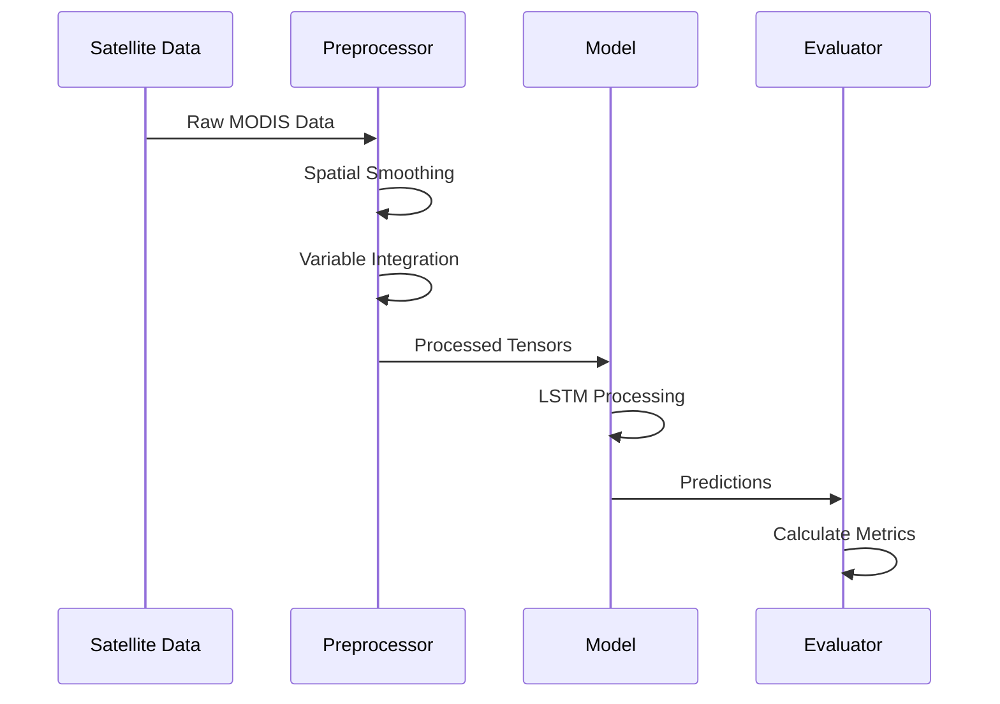

# ForestNet  Deep Learning Framework for Forest Intelligence Analysis

[](https://discord.gg/agora-999382051935506503) [](https://www.youtube.com/@kyegomez3242) [](https://www.linkedin.com/in/kye-g-38759a207/) [](https://x.com/kyegomezb)

[](https://opensource.org/licenses/MIT)
[](https://www.python.org/downloads/)
[](https://pytorch.org/)

## Overview

ForestNet is a novel deep learning framework designed to analyze and quantify collective forest intelligence through multi-variable temporal-spatial analysis. This research explores the hypothesis that forests exhibit emergent intelligent behaviors through their collective responses to environmental changes and stressors.

### Key Features
- Multi-scale temporal-spatial analysis of forest ecosystems
- Integration of multiple environmental variables
- Advanced LSTM-based predictive modeling
- Quantifiable intelligence metrics
- High-resolution data processing (50x50 grid)
- 5-year temporal analysis window

## Architecture



## Data Structure



## Installation

```bash
# Clone the repository
git clone https://github.com/Agora-Lab-AI/ForestNet.git
cd ForestNet

# Install dependencies
pip install -r requirements.txt
```

## Usage

```python
# Train the model
python3 main.py
```

## Dataset Description

SylvaNet utilizes multiple environmental variables collected over a 5-year period:

| Variable | Resolution | Frequency | Source |
|----------|------------|-----------|---------|
| NDVI | 50x50 grid | Daily | MODIS |
| Temperature | 50x50 grid | Daily | MODIS |
| Precipitation | 50x50 grid | Daily | MODIS |
| Soil Moisture | 50x50 grid | Daily | MODIS |
| Solar Radiation | 50x50 grid | Daily | MODIS |

## Model Performance

Intelligence metrics are calculated across three dimensions:

1. **Prediction Accuracy** (0-1)
   - Measures the model's ability to predict forest behavior
   - Typical range: 0.5-0.8

2. **Synchronization Score** (0-1)
   - Quantifies coordinated responses across forest regions
   - Typical range: 0.3-0.6

3. **Adaptive Capacity** (0-1)
   - Evaluates forest learning and adaptation
   - Typical range: 0.4-0.7

## Todo List

- [ ] Implement multi-GPU training support
- [ ] Add support for additional satellite data sources
- [ ] Integrate ground-based sensor data
- [ ] Develop visualization dashboard
- [ ] Add automated hyperparameter optimization
- [ ] Implement ensemble learning approaches
- [ ] Add support for real-time data processing
- [ ] Create API for external data integration
- [ ] Develop transfer learning capabilities
- [ ] Add detailed documentation and tutorials

## Research Team

- Principal Investigators: Kye Gomez
- Institution: Agora
- Lab: Agora Lab AI
- Contact: kye@swarms.world

## Citation

If you use ForestNet in your research, please cite:

```bibtex
@article{ForestNet2024,
  title={ForestNet: A Deep Learning Framework for Quantifying Collective Forest Intelligence},
  author={Kye Gomez et al.},
  year={2024},
  volume={},
  pages={},
  publisher={}
}
```

## Contributing

We welcome contributions! Please see our [CONTRIBUTING.md](CONTRIBUTING.md) for guidelines.

## License

This project is licensed under the MIT License - see the [LICENSE.md](LICENSE.md) file for details.

## Acknowledgments

- MODIS Science Team
- PyTorch Development Team
- agoralab.ai


## 📬 Contact

Questions? Reach out:
- Twitter: [@kyegomez](https://twitter.com/kyegomez)
- Email: kye@swarms.world

---

## Want Real-Time Assistance?

[Book a call with here for real-time assistance:](https://cal.com/swarms/swarms-onboarding-session)

---

⭐ Star us on GitHub if this project helped you!
